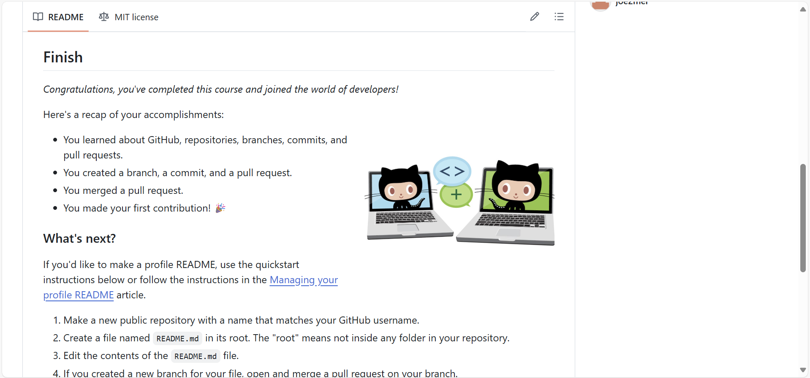

# Problem Set 1 

*1. What command would you use in a terminal shell if you wanted to list the files in your current directory, sorted in reverse order of when they were last edited? b) How would you expand on this command to also provide the date and time the file was last edited? c) Provide the manual description of at least one of the options required to produce this result.*

a) ls -tr
b) ls -ltr
c)

*2. If your "home directory" is /users/yourname/, provide three different commands that you can use to navigate from the directory /users/yourname/documents/ to your home directory:*

cd ~/, cd ../, cd /users/yourname/ 

*3. Provide the commands to do the following (in order):*

* Make a directory called 'Data'
    * mkdir Data
* Create a file called 'subj01.txt'
    * touch subj01.txt
* Create four copies of the file you just created for subject 2 - 5, as well as 11
    * cp subj01.txt subj02.txt 
    * cp subj01.txt subj03.txt
    * cp subj01.txt subj04.txt
    * cp subj01.txt subj05.txt 
    * cp subj01.txt subj11.txt
* Move all of the files into the 'Data' directory 
    * mv subj??.txt Data
* Delete all .txt files from the Data directory **except** for subj11.txt 
    * rm subj0?.txt

*4. Using the manual to learn about the function, create a pipe that uses the tee command. Describe the task you're aiming to perform, and provide any and all code needed to complete it. Be sure to upload any files that you needed to run this code.

wc Horse.txt |tee -a Pigeon.txt 

The wc command prints the number of lines, words, and bytes in the Horse.txt file. The pipe allows us to pass the wc command to the tee command. The tee command then outputs the wc command in the terminal as a standard output and is appended to the Pigeon.txt file. 

*5. Using the screen command, open up a screen. Using the history command and a pipe, write your command history to a file. Then exit the screen, and write your history to a new file again. Are these files the same? Why or why not? 

history |tee history.txt or history > history.txt 

No, these two files are not the same. This is because the history.txt file includes all of the history from the screen along with any preceding commands from the terminal. Whereas history2.txt includes only the history from the terminal preceding the screen and following the screen. 

*6. Complete the introduction to GitHub tutorial. Screenshot the message you receive when you complete the tutorial, and insert the image into your markdown file. 

